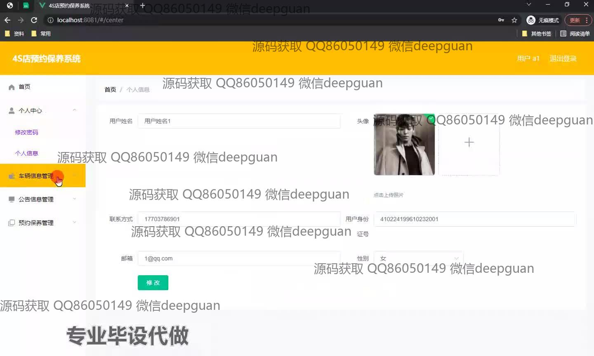
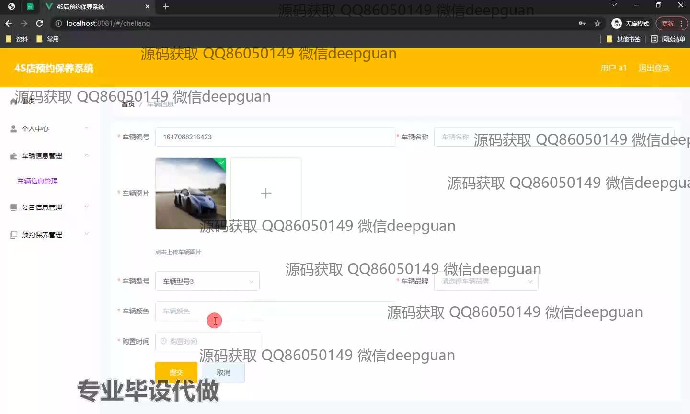
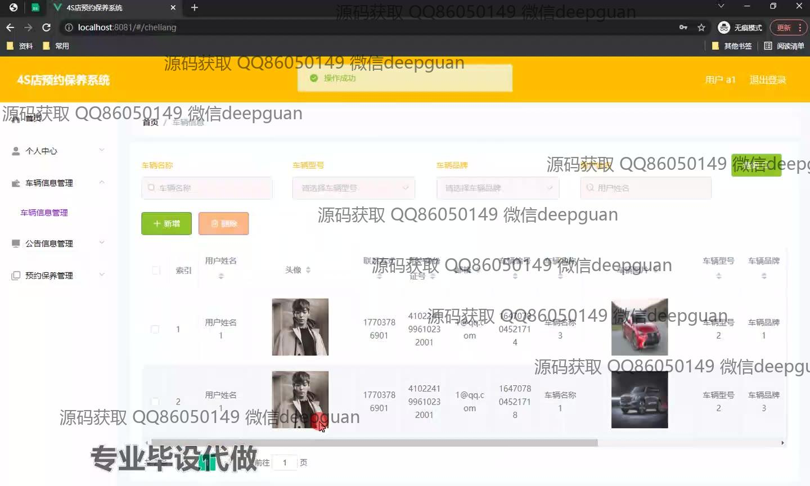
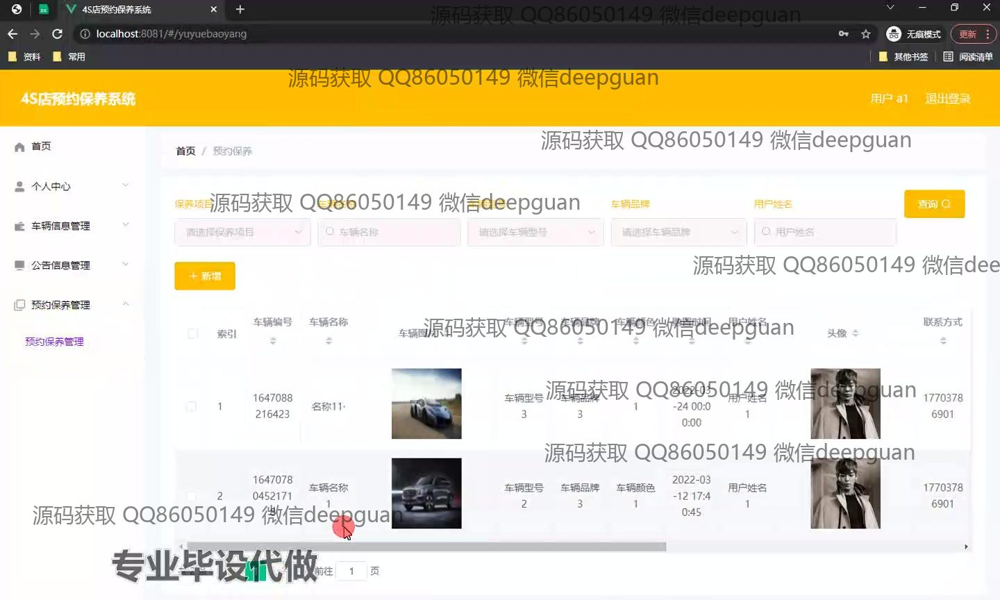
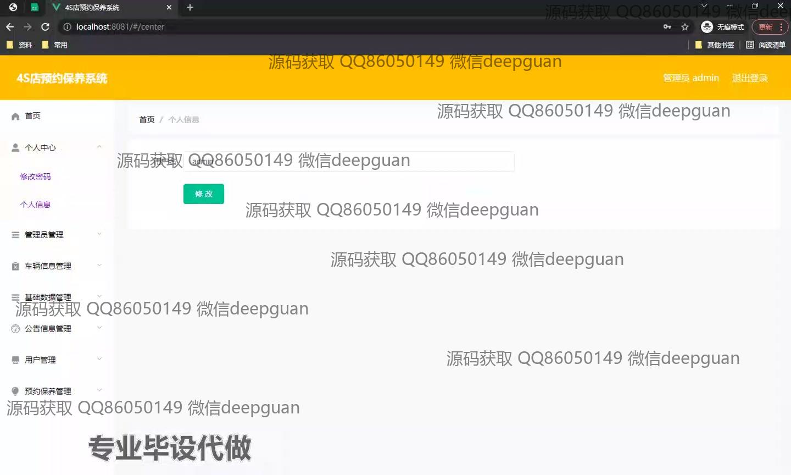
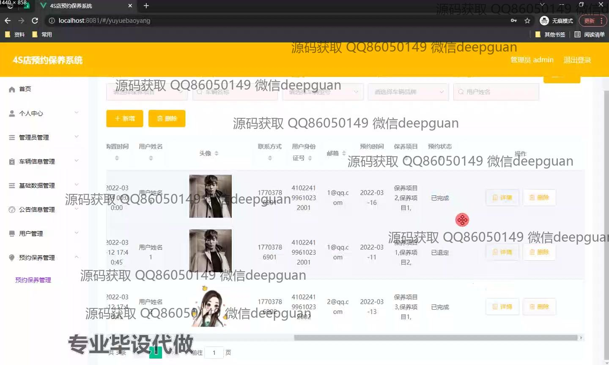
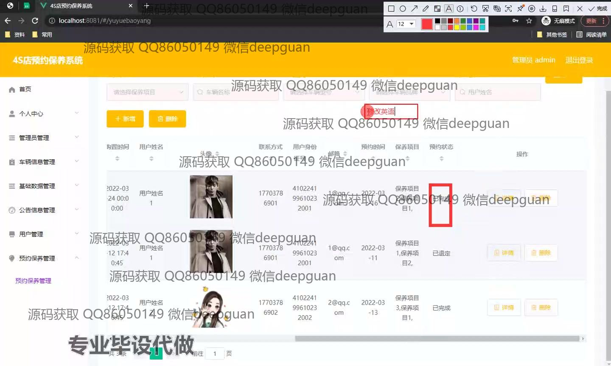
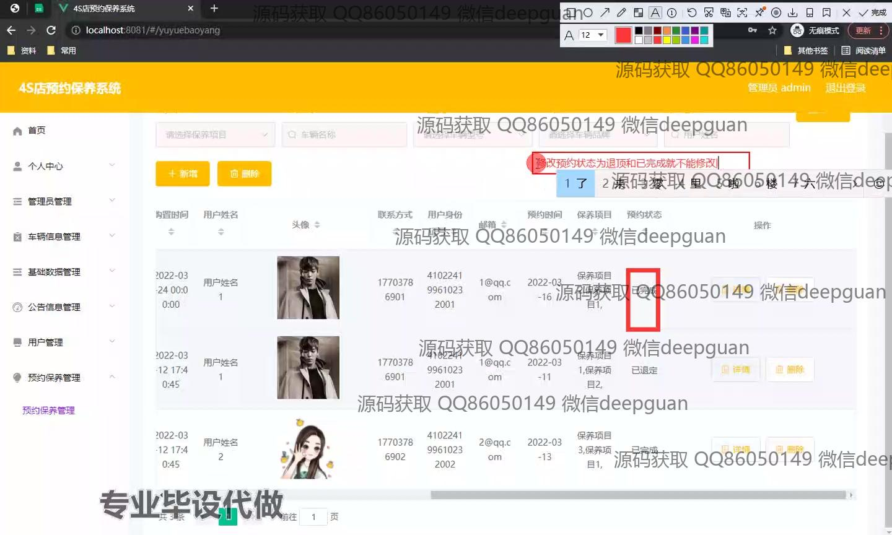

<h1 align="center">四S店预约保养系统开发+vue</h1>

## 简介
4S店预约保养系统：用户分为管理员和普通用户；功能包括个人信息管理、车辆信息管理、保养预约管理、公告信息管理和系统用户管理，基于Vue提高用户体验和管理效率。    --计算机毕业设计源码；毕设源码；java毕业设计源码

## 联系方式

<h3 align="center">获取完整代码与数据库文件 + 微信：deepguan QQ: 86050149 QQ群: 783742310</h3>

<h3 align="center">可帮忙远程部署 包运行成功！提供远程部署、修改代码、设计文档指导、代码讲解等服务！</h3>

## 功能介绍（完整见运行截图）
管理员：管理员主要负责管理和维护预约保养系统，包括查看和修改公告信息，管理用户信息，查看和处理保养预约，确保系统的稳定运行。管理员可以增删车辆信息，查看详细预约记录，并对系统各功能模块进行配置与管理，以支持4S店的业务需求。

用户：用户可以通过系统进行个人信息的管理和预约保养服务。他们可以修改个人资料，上传头像，添加或编辑车辆信息，以及查询、预约和管理车辆保养服务。此外，用户可以查看公告信息，确保他们能获取到最新的4S店通知和政策。用户界面设计旨在提供简洁易用的人机交互体验，使用户能轻松完成保养预约和相关管理操作。

## 运行截图

本代码来源于网络,仅供学习参考使用!

